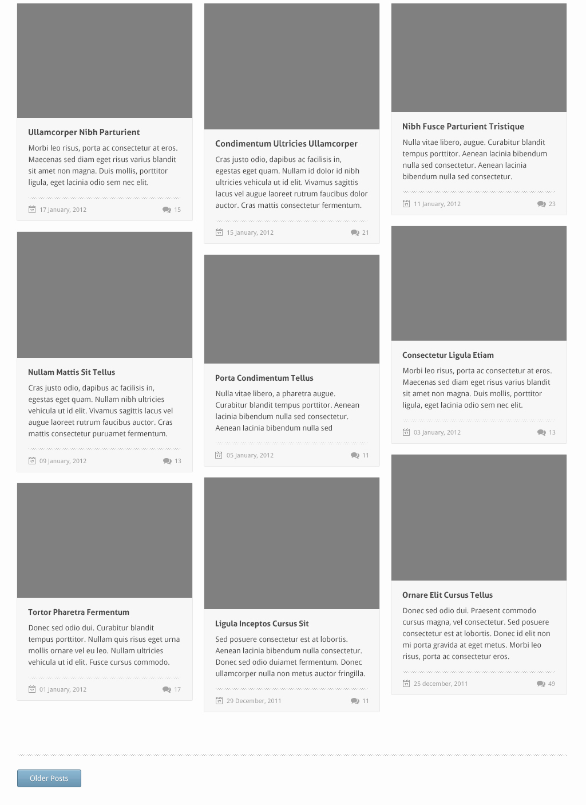

# ikaros
Theme Business &amp; Portfolio

|  |  |  |
|----------|:-------------:|------:|

## [Download - PSDs](https://drive.google.com/file/d/0B7tB0AtEFK2bcGpId09mdGpWdW8/view?usp=sharing)

## Developers
[@theandersonn](https://github.com/theandersonn)

## Folders Structure
	.
	├── dist/
	├── src/
	|   ├── assets/
	|   |   ├── css/
	|   |   ├── fonts/
	|   |   ├── images/
	|   |   ├── js/
	|   |   └── sass/		
	|   |
	|   ├── about.html
	|   ├── blog.html
	|   ├── contact.html
	|   ├── index.html
	|   ├── portfolio.html
	|   ├── service.html		
	|   └── single.html
	|
	├── gulp/
	|   ├── .publish/
	|   ├── node_modules/
	|   ├── tasks/	
	|   ├── gulpfile.js
	|   └── package.json
	|									
	├── .gitignore
	├── LICENSE.md	
	└── README.md

## About the project